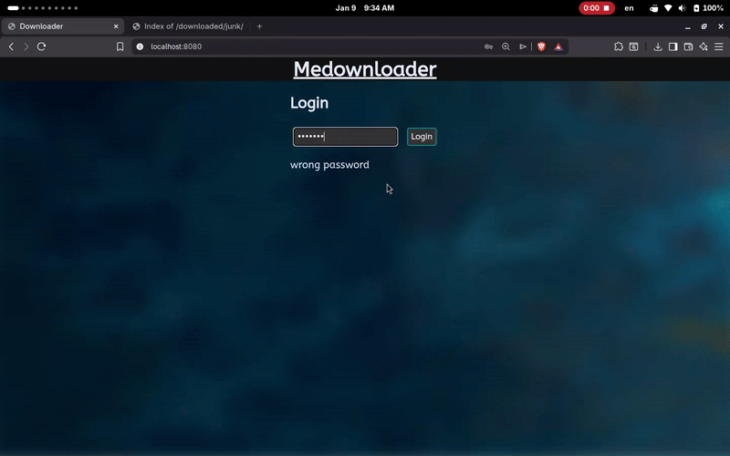

# Medownloader

Medownloader is a simple downloader app and server written in Go. The app allows you to download files accessible via HTTP/HTTPS. The Web UI is accessible via your device's IP address and the app port (default: 8080).

The app has the following features:  
- Login with a master password  
- Per-device sessions using cookie tokens and session middleware on server
- Display of free space and current directory  
- Ability to specify the name of downloaded files  
- Deletion and stopping of currently running downloads  
- Change of password, session duration, and other settings





## How to Run

The entire app is conveniently bundled into a single, statically compiled binary. The app has been tested only on Linux, but it should also work on other Unix-like OSes and Windows.  

The simplest way to run the app executable is from the terminal:
```
./medownloader
```
Alternatively, you can compile or run app with Go compiler:

```
go build  -o medownloader cmd/medownloader/main.go
go run cmd/medownloader/main.go
```

Then, access the Web UI in your browser at `http://localhost:8080/` or `http://<device_ip>:<selected_port>/`.  

Additional configuration can be done using command-line flags and environment variables.  
The output when using the `--help` flag is:

```
Medownloader is simple downloader app and server written in golang.
Default password is "password", but can be changed with env. variable ME_PASSWORD

Usage of medownloader:
  -port int
    	server port, same as env. variable ME_PORT (default 8080)
  -sessionDuration int
    	session duration in minutes, same as env. variable ME_SESSION_DURATION (default 30)

```
